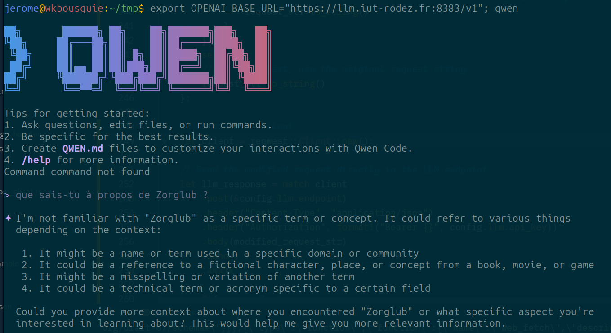
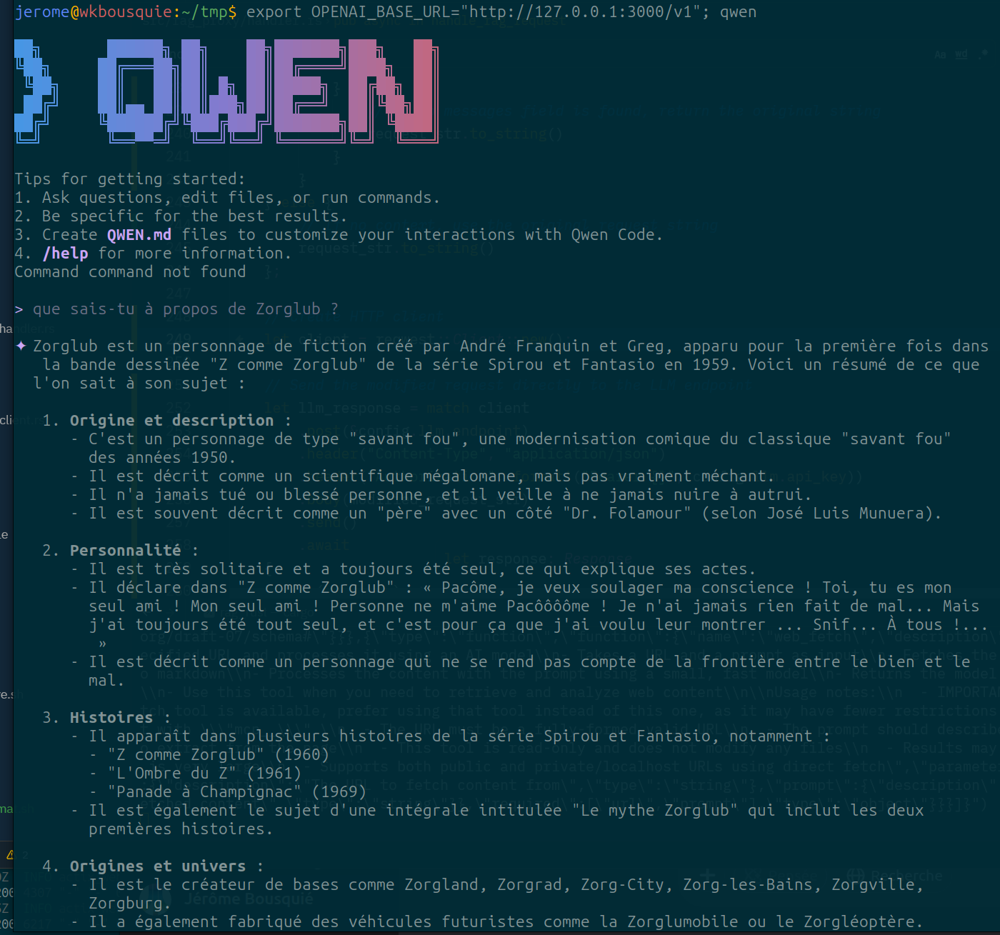

# Demo
QwenCLI interroge une instance locale de Qwen3-Coder à propos de Zorglub

QwenCLI interroge le même Qwen3-Coder local en passant par le proxy RAG dans lequel on a chargé le fichier PDF de la page Wikipédia de Zorglub


# Proxy RAG Rust

Ce projet implémente un **proxy RAG (Retrieval-Augmented Generation)** simple en **Rust**. Son objectif est de servir d'intermédiaire entre un client (comme un CLI ou un agent IA comme Zed) et un LLM distant (dans votre cas, une instance Qwen3-Coder derrière un reverse-proxy OpenAI API). Le proxy récupère des informations pertinentes à partir d'une base de connaissances vectorielle locale avant d'envoyer la requête enrichie au LLM distant, améliorant ainsi la pertinence des réponses.

> **Note :** Ce projet est conçu comme un **Proof of Concept (PoC)** pour tester l'approche RAG en Rust, en remplacement d'une [implémentation Python](https://github.com/jbousquie/proxy_rag) existante.

## Fonctionnalités

*   **Proxy RAG Local :** Intercepte les requêtes du client, effectue une recherche RAG, puis transmet la requête enrichie au LLM distant.
*   **Indexation Locale :** Lit et indexe des documents (formats texte, PDF, DOCX, etc.) dans une base de connaissances vectorielle locale. Le processus d'indexation :
    *   Charge les documents depuis le dossier `data_sources/`
    *   Découpe le contenu en fragments (chunks) de taille configurable
    *   Génère des embeddings pour chaque fragment en appelant Ollama
    *   Stocke les fragments et leurs embeddings dans Qdrant
    *   Suivi des fichiers indexés pour éviter le retraitement des fichiers non modifiés
*   **Génération d'Embeddings Locaux :** Utilise une instance [Ollama](https://ollama.ai/) locale (modèle `Qwen3-Embeddings`) pour générer les embeddings nécessaires à l'indexation et à la recherche.
*   **Recherche Vectorielle :** Effectue une recherche sémantique dans la base de connaissances vectorielle locale.
*   **Communication avec LLM Distant :** Le module `handler.rs` gère directement la communication avec le LLM distant via une API compatible OpenAI, en envoyant la requête enrichie avec le contexte RAG.
*   **Séparation des Responsabilités :** Le code est organisé en deux composants principaux : un outil d'indexation et un serveur proxy.
*   **Serveur HTTP Axum :** Le proxy RAG est implémenté avec un serveur HTTP Axum qui expose l'endpoint `/v1/chat/completions` configurable via `config.toml`.
*   **Traitement des Requêtes Utilisateur :** Le handler pour les requêtes utilisateur :
    *   Reçoit les requêtes du client
    *   Calcule l'embedding de la requête utilisateur
    *   Interroge Qdrant pour trouver les fragments similaires stockés
    *   Construit un prompt enrichi avec le contexte récupéré
    *   Envoie le prompt au LLM distant
    *   Retourne la réponse au client
    *   **Amélioration :** Le contexte récupéré est maintenant inclus dans le prompt envoyé au LLM pour améliorer la pertinence des réponses.
    *   **Amélioration :** Ajout du champ `usage` dans les réponses pour une meilleure compatibilité avec différents clients
    *   **Amélioration :** Ajout des headers HTTP appropriés pour une meilleure compatibilité avec QwenCLI
    *   **Mode de débogage :** Ajout d'un mode `--passthrough` pour le proxy qui fait simplement du relais sans traitement RAG
    *   **Amélioration :** Le proxy RAG préserve maintenant exactement la structure originale des requêtes, en étendant uniquement le message système existant avec le contexte RAG (comportement de type 'passthrough' pour la structure des requêtes)
    *   **Compatibilité QwenCLI :** Correction du problème de compatibilité avec QwenCLI en utilisant une approche hybride : extraction du texte original du message système, enrichissement avec le contexte RAG, remplacement direct dans le body JSON sans reconstruction de la structure globale, envoi direct de la requête modifiée au LLM sans transformation en structure Rust, et réponse du LLM relayée directement au client sans reconstruction de la structure de réponse, combinant ainsi les avantages du mode 'passthrough' avec les fonctionnalités RAG
    *   **Optimisation du message système :** Ajout d'une configuration optionnelle `system_message_fingerprint_length` pour optimiser le remplacement du message système dans les requêtes RAG. Cette option permet d'utiliser une empreinte (fingerprint) de N caractères pour cibler précisément le remplacement dans le corps JSON, ce qui est plus efficace pour les très longs messages système. La valeur par défaut est de 255 caractères.
*   **Réinitialisation des données :** Possibilité de réinitialiser complètement la base de connaissances vectorielle avec la commande `cargo run --bin reset_documents`, qui supprime la collection Qdrant et réinitialise le fichier de suivi des fichiers indexés.
*   **Gestion Robuste des Erreurs :** Le projet utilise une stratégie de gestion des erreurs centralisée via un type `AppError` personnalisé (basé sur `thiserror`). Toutes les paniques (`unwrap`, `expect`) ont été éliminées au profit d'une propagation propre des erreurs, garantissant que le serveur ne crashe pas en cas d'imprévu et retourne des codes d'erreur HTTP appropriés.
*   **Logging Structuré :** Utilisation de `tracing` pour un logging professionnel avec niveaux de sévérité (info, warn, error) et timestamps, remplaçant les `println!` et `eprintln!`.
*   **Architecture Modulaire :**
    *   **Clients API Centralisés :** Les appels HTTP vers Ollama et le LLM sont encapsulés dans des modules dédiés (`OllamaClient`, `LlmClient`) pour éviter la duplication de code.
    *   **Chargement de Fichiers Trait-based :** Architecture extensible basée sur le trait `DocumentLoader` avec des implémentations spécifiques (`TextLoader`, `PdfLoader`, `DocxLoader`) facilitant l'ajout de nouveaux formats.
    *   **Injection de Dépendances :** La configuration est chargée une fois au démarrage et partagée via `State<Arc<Config>>` dans les handlers Axum.

## Prérequis

*   **Rust :** [Installez Rust](https://www.rust-lang.org/tools/install) (version 1.70.0 ou supérieure recommandée).
*   **Ollama :** Doit être installé et en cours d'exécution sur la machine locale. Le modèle `Qwen3-Embeddings` doit être disponible :
    ```bash
    curl -fsSL https://ollama.ai/install.sh | sh
    ollama pull Qwen3-Embeddings
    ```
*   **Base Vectorielle :** (Pour l'instant, Qdrant est prévu) [Installez Qdrant localement](https://github.com/qdrant/qdrant?tab=readme-ov-file#quick-start) (soit via binaire, soit via Docker).
    *   *Exemple avec binaire :* Téléchargez la dernière version depuis [https://github.com/qdrant/qdrant/releases](https://github.com/qdrant/qdrant/releases), décompressez et exécutez `./qdrant`.
    *   *Exemple avec Docker :*
        ```bash
        docker run -p 6333:6333 -p 6334:6334 qdrant/qdrant
        ```
*   **LLM Distant :** Accès à une instance Qwen3-Coder (ou similaire) via une API compatible OpenAI, accessible via votre reverse-proxy.

## Problème connu avec les fichiers PDF volumineux

Le projet utilise la crate `pdf-extract` pour lire les fichiers PDF. Cette crate peut provoquer une panique lors du traitement de fichiers PDF très volumineux (par exemple, 3500 pages) ou ayant une structure particulière. Pour gérer ce problème, nous avons implémenté une solution qui intercepte ces paniques et permet au processus de continuer. Un problème a été ouvert sur le dépôt GitHub de la crate `pdf-extract` à ce sujet. Veuillez remplacer [NUMÉRO_DU_PROBLÈME] par le numéro réel une fois que l'issue est créée.

Lorsque cette situation se produit, le contenu du PDF n'est pas indexé (une chaîne vide est retournée à la place), mais le processus d'indexation continue pour les autres fichiers.

## Stack Technique

*   **Langage :** [Rust](https://www.rust-lang.org/)
*   **Serveur HTTP :** [axum](https://crates.io/crates/axum)
*   **Lecture de fichiers :** `tokio::fs`, [pdf-extract](https://crates.io/crates/pdf-extract) (PDF), [docx-rust](https://crates.io/crates/docx-rust) (DOCX)
*   **Découpage de texte (Chunking) :** [text-splitter](https://crates.io/crates/text-splitter) (ou logique manuelle)
*   **Appels HTTP (Ollama, LLM distant) :** [reqwest](https://crates.io/crates/reqwest)
*   **Base de Données Vectorielle :** [qdrant-client](https://crates.io/crates/qdrant-client)
*   **(Optionnel) Appel LLM distant (OpenAI API) :** [openai-rs](https://crates.io/crates/openai-rs) (si compatible avec votre reverse-proxy)

## Structure du Projet

```text
.
├── Cargo.toml          # Dépendances et définition des binaires
├── src/
│   ├── lib.rs          # Fonctions utilitaires partagées et type AppError
│   ├── qdrant_custom_client.rs  # Client personnalisé pour Qdrant
│   ├── clients/        # Clients API centralisés
│   │   ├── mod.rs
│   │   ├── ollama.rs   # Client pour Ollama (génération d'embeddings)
│   │   └── llm.rs      # Client pour le LLM distant
│   ├── indexing/       # Logique d'indexation
│   │   ├── mod.rs
│   │   ├── loader.rs   # Chargement des fichiers (trait-based)
│   │   ├── chunker.rs  # Découpage du texte
│   │   ├── indexer.rs  # Génération des embeddings (Ollama) + Stockage (Qdrant)
│   │   ├── file_tracker.rs # Suivi des fichiers indexés
│   │   └── main.rs     # Point d'entrée du binaire d'indexation
│   ├── rag_proxy/      # Logique du serveur proxy RAG
│   │   ├── mod.rs
│   │   ├── server.rs   # Démarrage du serveur axum
│   │   ├── handler.rs  # Gestion d'une requête : Recherche RAG -> Appel LLM -> Réponse
│   │   ├── retriever.rs # Recherche dans Qdrant
│   │   ├── passthrough_handler.rs # Gestion des requêtes en mode 'passthrough' sans RAG
│   │   └── main.rs     # Point d'entrée du binaire du proxy RAG
│   └── reset_documents/ # Logique de réinitialisation des documents
│       └── main.rs     # Point d'entrée du binaire de réinitialisation
├── data_sources/       # Dossier source pour les documents à indexer
├── index_tracker.json  # Fichier de suivi des fichiers indexés
└── ...
```

## Client Qdrant personnalisé

Le module `qdrant_custom_client.rs` fournit un client personnalisé pour interagir avec Qdrant :

### Méthodes disponibles

- `new(host: String, port: u16, api_key: String)` - Crée une nouvelle instance du client Qdrant
- `health_check() -> Result<TelemetryResponse, reqwest::Error>` - Vérifie si le serveur Qdrant est en ligne en appelant le endpoint `/telemetry`
- `health_check_blocking() -> Result<TelemetryResponse, reqwest::Error>` - Version synchrone de health_check
- `collection_exists(collection_name: &str) -> Result<bool, reqwest::Error>` - Vérifie si une collection existe dans Qdrant en appelant le endpoint `/collections/{collection_name}/exists`
- `collection_exists_blocking(collection_name: &str) -> Result<bool, reqwest::Error>` - Version synchrone de collection_exists
- `create_collection(collection_name: &str) -> Result<bool, reqwest::Error>` - Crée une collection dans Qdrant avec une configuration de vecteur par défaut (taille 384, distance Cosine)
- `create_collection_blocking(collection_name: &str) -> Result<bool, reqwest::Error>` - Version synchrone de create_collection
- `upsert_points(collection_name: &str, points: Vec<Point>) -> Result<bool, reqwest::Error>` - Insère ou met à jour des points (vecteurs) dans une collection Qdrant
- `upsert_points_blocking(collection_name: &str, points: Vec<Point>) -> Result<bool, reqwest::Error>` - Version synchrone de upsert_points
- `delete_collection(collection_name: &str) -> Result<bool, reqwest::Error>` - Supprime une collection dans Qdrant
- `delete_collection_blocking(collection_name: &str) -> Result<bool, reqwest::Error>` - Version synchrone de delete_collection

## Installation et Démarrage

Assurez-vous que les prérequis (Rust, Ollama, Qdrant) sont installés et en cours d'exécution.
Clonez ce dépôt :
```shell
git clone <URL_DE_VOTRE_DEPOT>
cd votre_proxy_rag
```

Compilez les binaires :
```shell
cargo build --release
```

Indexez vos documents : Placez vos documents dans le dossier `data_sources/`. Puis, exécutez le binaire d'indexation :
```shell
cargo run --bin index_documents
# OU
./target/release/index_documents
```

Lancez le serveur proxy : Configurez les variables d'environnement nécessaires (clé API du LLM distant, URL du LLM distant, URL de Qdrant, etc.) dans un fichier `.env` ou directement dans votre environnement. Ensuite, exécutez le binaire du proxy :
```shell
cargo run --bin rag_proxy
# OU
./target/release/rag_proxy
```

Réinitialisez la base de connaissances : Pour supprimer la collection Qdrant et réinitialiser le fichier de suivi des fichiers indexés, exécutez :
```shell
cargo run --bin reset_documents
# OU
./target/release/reset_documents
```

Configurez votre client (CLI, Zed, etc.) pour qu'il envoie ses requêtes au serveur proxy démarré (par exemple, http://localhost:3000 si le serveur écoute sur ce port).

## Configuration

Le projet utilise un fichier central de configuration `config.toml` qui permet de définir toutes les options de configuration du proxy RAG. Ce fichier contient les paramètres suivants :

- Configuration des sources de données (chemin vers le dossier des documents)
- Paramètres du proxy RAG (port et host d'écoute)
- Configuration de l'API LLM (endpoint, modèle, clé d'API)
- Configuration de Qdrant (host, port, clé d'API, vector_size, distance)
- Configuration de l'indexation (taille des fragments de texte, taille des lots pour les embeddings)

Le fichier de configuration permet de centraliser la configuration de l'application et d'éviter la configuration manuelle via les variables d'environnement ou les arguments de ligne de commande.

### Paramètres Qdrant


```toml
[qdrant]
# Configuration de Qdrant
host = "localhost"
port = 6333
api_key = "qdrantapikey"
collection = "rag_documents"   # nom de la collection
vector_size = 4096             # taille des vecteurs dans la collection
distance = "Cosine"            # distance de similarité utilisée dans la base de données vectorielle
limit = 10                     # nombre maximum de résultats pour les requêtes
score_threshold = 0.7          # seuil de score pour les résultats de recherche f32
```

Ces paramètres permettent de spécifier la taille des vecteurs et la distance de similarité utilisée dans la base de données vectorielle, ce qui correspond à la configuration de votre modèle d'embedding.

### Paramètres du Proxy RAG

```toml
[rag_proxy]
# Configuration du proxy RAG
host = "localhost"
port = 3000
chat_completion_endpoint = "/v1/chat/completions"
# Taille du "fingerprint" utilisé pour la mise à jour intelligente du message système
# dans les requêtes RAG. Permet d'éviter de remplacer accidentellement du contenu
# similaire dans d'autres parties de la requête. Une valeur de 255 caractères
# est généralement suffisante pour assurer l'unicité tout en restant efficace.
system_message_fingerprint_length = 255
```

Ces paramètres permettent de configurer les aspects du serveur proxy RAG, y compris l'endpoint exposé et le comportement de remplacement du message système.

### Endpoint configurable

L'endpoint `/v1/chat/completions` du proxy RAG est configurable via `config.toml` dans la section `[rag_proxy]` :

```toml
[rag_proxy]
# Configuration du proxy RAG
host = "localhost"
port = 3000
chat_completion_endpoint = "/v1/chat/completions"
# Taille du "fingerprint" utilisé pour la mise à jour intelligente du message système
# dans les requêtes RAG. Permet d'éviter de remplacer accidentellement du contenu
# similaire dans d'autres parties de la requête. Une valeur de 255 caractères
# est généralement suffisante pour assurer l'unicité tout en restant efficace.
system_message_fingerprint_length = 255
```

Cela permet de personnaliser l'endpoint exposé par le serveur proxy RAG ainsi que le comportement de remplacement du message système.

## Étapes Suivantes / Extensibilité

* Re-ranking : Grâce à l'utilisation de Qdrant, l'intégration future de fonctionnalités de re-ranking natives est possible.
* Support d'autres formats de documents : Ajouter des crates pour lire d'autres formats (PowerPoint, etc.).
* Sécurité : Ajouter de l'authentification/autorisation si nécessaire.
* Monitoring : Intégrer des outils de logging et de métriques.

## Licence

Ce projet est sous licence MIT.
